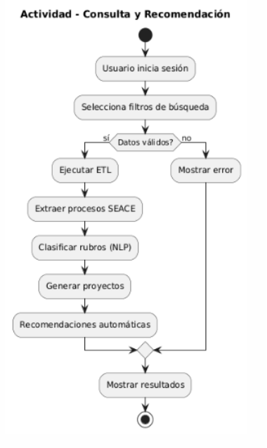
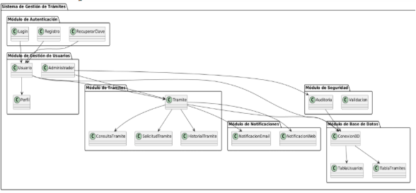
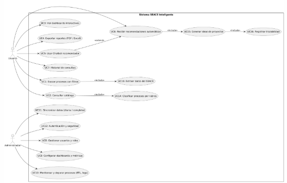
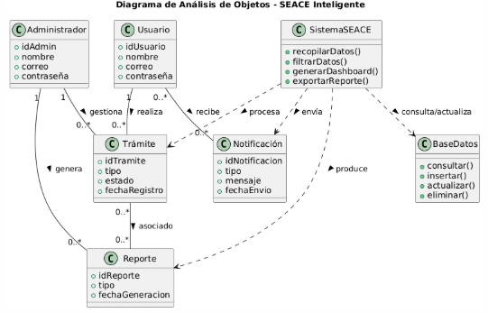
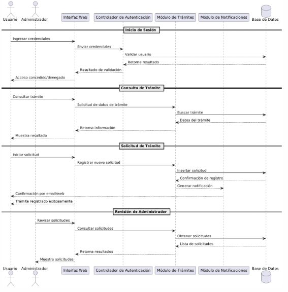
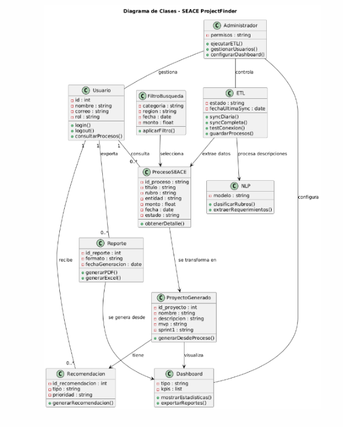



**UNIVERSIDAD PRIVADA DE TACNA**

**FACULTAD DE INGENIERÍA**

**Escuela Profesional de Ingeniería de Sistemas**
**\
\

` `**“Proyecto *SEACE ProjectFinder”***

**Curso:** 

*Inteligencia de Negocios*

**Docente:** 

*Mag. Patrick Cuadros Quiroga*\

**Integrantes:**

*Akhtar Oviedo, Ahmed Hasan		-	(2022074261)*

*Anampa Pancca, David Jordan		-	(2022074268)*

*Salas Jimenez, Walter Emmanuel 	-	(2022073896)*

**Tacna – Perú**

*2025*

|CONTROL DE VERSIONES||||||
| :-: | :- | :- | :- | :- | :- |
|Versión|Hecha por|Revisada por|Aprobada por|Fecha|Motivo|
|1\.0|AHAO,  DJAP, WESJ|ERM|-|09/09/25|Versión 1.0|
|2\.0|AHAO,  DJAP, WESJ|ERM|-|01/11/25|Versión 2.0|

**Proyecto *SEACE ProjectFinder***

**Documento de Especificación de Requerimientos de Software**

**Versión *2.0***

**ÍNDICE GENERAL**

[ÍNDICE GENERAL	3](#_heading=h.6xkuqvg4p4em)

[1. Generalidades de la empresa	5](#_heading=h.1fob9te)

[1.1. Nombre de la Empresa	5](#_heading=h.3znysh7)

[1.2. Visión	5](#_heading=h.2et92p0)

[1.3. Misión	5](#_heading=h.tyjcwt)

[1.4. Organigrama	5](#_heading=h.3dy6vkm)

[2. Visionamiento de la Empresa	6](#_heading=h.cfdbh0ikj4py)

[2.1. Descripción del Problema	6](#_heading=h.8mebvenlu40k)

[2.2. Objetivos de Negocios	6](#_heading=h.dhmt6uwetjpz)

[2.3. Objetivos de Diseño	7](#_heading=h.57hgze9icrjb)

[2.4. Alcance del Proyecto	8](#_heading=h.xqwlfn1htcip)

[2.5. Viabilidad del Sistema	8](#_heading=h.ib5nccxvituj)

[2.5.1. Viabilidad Técnica	8](#_heading=h.ubpb379ykssr)

[2.5.2. Viabilidad Económica	10](#_heading=h.uyvgsc2314m0)

[2.5.3. Viabilidad Operativa	12](#_heading=h.isjru1hdy9ru)

[2.5.4. Viabilidad Legal	13](#_heading=h.vkkkiva79vwn)

[2.5.5. Viabilidad Social	15](#_heading=h.44a0y1mwrdgh)

[2.5.6. Viabilidad Ambiental	16](#_heading=h.iaszph9wlils)

[2.6. Información obtenida del Levantamiento de Información	18](#_heading=h.hp1rzpcout9c)

[3. Análisis de Procesos	19](#_heading=h.nbeyj5kuxvzq)

[3.1. Diagrama del Proceso Actual	19](#_heading=h.z8d6duq7tnk6)

[3.2. Diagrama del Proceso Propuesto	20](#_heading=h.9tpbspb6p2xf)

[4. Especificación de Requerimientos de Software	22](#_heading=h.u0uokb3cdnz8)

[4.1. Cuadro de Requerimientos Obtenidos	22](#_heading=h.w5pvwvo3lifv)

[4.2. Cuadro de Requerimientos Funcionales	23](#_heading=h.terlb2e9p6it)

[4.3. Cuadro de Requerimientos No Funcionales	25](#_heading=h.a1idutradbym)

[4.4. Reglas de Negocio \
Tabla 4: Cuadro de Reglas de Negocio. Fuente de origen: Propia.	26](#_heading=h.kpluxzjowy5k)

[5. Fase de Desarrollo	29](#_heading=h.expxnqnpnwvw)

[5.1. Perfiles de Usuario	29](#_heading=h.a7uizowpl43n)

[5.1.1. Estudiante	29](#_heading=h.72r6mgypc8y5)

[5.1.2. Mentor	29](#_heading=h.acdhwufnhpe9)

[5.1.3. Docente Encargado	30](#_heading=h.or3g3emdyuaf)

[5.2. Modelo Conceptual	31](#_heading=h.tu14ejx3zcdo)

[5.2.1. Diagrama de Paquetes	31](#_heading=h.ses1b3fci5lg)

[Comentario: Tenemos el diagrama de paquetes del Sistema Web  AMS.	31](#_heading=h.3x0kaa90hyax)

[Comentario: Tenemos el diagrama de paquetes del Sistema Escritorio AMS.	32](#_heading=h.rxwb4twjpu7y)

[5.2.2. Diagrama de Casos de Uso	33](#_heading=h.wjsnnaxqso62)

[Comentario: Tenemos el diagrama de Casos de Uso del Sistema Escritorio AMS.	33](#_heading=h.i6c4ql3uhzdu)

[5.2.3. Escenarios de Caso de Uso (Narrativa)	35](#_heading=h.9nciw2aa5n0x)

[5.3. Modelo Lógico	47](#_heading=h.nn3prmijtbxw)

[5.3.1. Analisis de Objetos	47](#_heading=h.e7cwuedsq20z)

[5.3.2. Diagrama de Secuencia	49](#_heading=h.kklcr44g4lq2)

[5.3.3. Diagrama de Clases	53](#_heading=h.cosq6z5a9ivf)

[CONCLUSIÓN	56](#_heading=h.dywxh6tz9eqh)

[RECOMENDACIONES	57](#_heading=h.cgfxgb2lacqc)

**Documento de Especificación de Requerimientos de Software**

1. **Generalidades de la empresa**
   1. ## **Nombre de la Empresa**

Área de Responsabilidad Social Universitaria y Proyección Social (RSU/Proyección) de la Universidad Privada de Tacna (UPT).
1. ## **Visión**

Consolidar una cultura de **responsabilidad social y voluntariado universitario** que articule a la UPT con su entorno, generando **impacto social medible** y formación integral del estudiante. Ser **referente regional** en programas de voluntariado y proyectos sostenibles que mejoren la calidad de vida de la comunidad.
1. ## **Misión**

**Planificar, coordinar y supervisar** campañas de voluntariado y proyectos de proyección social que fortalezcan la **formación humana y profesional** del estudiante, fomenten la **participación responsable** y aseguren la **pertinencia e impacto** de la UPT en la sociedad. Para ello, RSU/Proyección define lineamientos, establece alianzas y promueve procesos **transparentes y trazables**.

1. **Visionamiento de la Empresa**	
   1. ## **Descripción del Problema**
      En la UPT, la gestión del voluntariado se realiza con **procesos dispersos** (formularios, hojas y correos). Esto provoca **sobrecupo**, **no-shows**, demoras y errores en la **emisión de constancias**, y una **baja trazabilidad** de quién se inscribió, asistió y por cuántas horas. En el punto de atención no existe un **mecanismo móvil estandarizado** para **identificar** y **validar** rápidamente la participación del estudiante; cada coordinador resuelve “a su modo”, lo que dificulta el control y la transparencia.

      Problemas actuales más notorios:

- Inscripciones y confirmaciones lentas o duplicadas; nula gestión real de lista de espera.
- Control de asistencia manual propenso a error (marcaciones tardías o no verificables).
- Certificados/constancias emitidos con retraso y sin un medio simple de verificación.
- Ausencia de reportes confiables por campaña/escuela y poca evidencia para la toma de decisiones.

El **MVP** aborda la parte **mínima y crítica**: disponer de una app móvil que permita **iniciar sesión local** y **leer un QR** para ofrecer un **resultado inmediato en el dispositivo**, validando la **viabilidad técnica** del flujo antes de incorporar inscripciones, asistencia formal, certificados y reportes con backend.
1. **Objetivos de Negocios**\

   ---------------------------------------------------------------
- **Validar en campo** un flujo mínimo “**Login → Escaneo QR → Resultado**” que reduzca errores en el registro en punto de atención.
- **Mejorar la experiencia** para estudiantes y coordinadores con una interacción **rápida y clara** (mensajes comprensibles, sin dependencia de internet).
- **Obtener evidencia** (tiempos, tasas de lectura, fallos) para decidir el **siguiente incremento** funcional priorizado por RSU.
- **Sentar bases de gobernanza** (seguridad local, accesibilidad mínima, manual breve) que faciliten la **adopción institucional**.
- **Preparar la escalabilidad** hacia un modelo con **backend** (Firebase/MySQL) que habilite inscripciones con **FIFO**, asistencia formal, certificados verificables y reportes.
  1. **Objetivos de Diseño**\

     -------------------------------------------------------------
- **Acceso local seguro:** login básico sin servidor; hash + sal para credenciales de prueba; sin PII persistida; cierre de sesión visible.
- **Lector QR confiable:** permisos de cámara, enfoque y lectura estable; validación local del formato/patrón; estados claros (válido / inválido / no encontrado).
- **Operación offline con caché efímera:** almacenamiento local temporal (p. ej., timestamp + estado); limpieza sencilla desde la app.
- **Rendimiento y robustez:** tiempo percibido < 1,5 s del escaneo al resultado; ≥95% de lecturas correctas en condiciones típicas; manejo de errores sin caídas.
- **Compatibilidad y UX mínima accesible:** APK para Android de gama media/baja; contraste legible, tipografía clara y controles táctiles ~44×44 px; textos consistentes en español.
- **Mantenibilidad y documentación:** código modular, repositorio versionado, guía de instalación/uso (1–2 páginas) y checklist de pruebas del MVP.
- **Escalabilidad futura (diseño preparado):** separación clara de capas para integrar servicios backend (Firebase/MySQL), API y verificación pública, sin reescribir la app.
**\
\

1. **Alcance del Proyecto**\

   --------------------------------------------------------------
   El proyecto se implementará inicialmente en la Universidad Privada de Tacna (UPT), con pilotaje en coordinación con RSU/Proyección y la Escuela de Ingeniería de Sistemas dentro del curso Soluciones Móviles I. El MVP demuestra la cadena mínima de valor sin backend: login local, lectura/validación de códigos QR y almacenamiento temporal en caché en el dispositivo, operando offline.

   Este alcance permite validar en entorno real la viabilidad técnica, la usabilidad básica y la estabilidad del escaneo antes de incorporar funciones de negocio. En iteraciones posteriores se prevé ampliar a: publicación de campañas, inscripciones con FIFO, control formal de asistencia (QR + respaldo manual auditado), certificados verificables y reportes; para ello se integrará persistencia mediante Firebase y/o MySQL y, más adelante, un portal web para RSU.

   A mediano plazo, se busca escalar la solución a otras escuelas de la UPT y, eventualmente, compartir el modelo con otras universidades, priorizando siempre una evolución incremental que no requiera reescritura de la app móvil.
1. **Viabilidad del Sistema**	\

   -----------------------------------------------------------------
   1. ### **Viabilidad Técnica**
      1. **Disponibilidad de tecnología**: El MVP utiliza tecnologías consolidadas y de uso libre: Flutter/Dart (APK Android), Android SDK y una librería open-source de lectura de QR. El almacenamiento local se resuelve con mecanismos ligeros de caché, sin servidores externos. Para fases futuras se contempla Firebase y/o MySQL como backend, manteniendo una arquitectura cliente-servidor estándar (REST/HTTPS) sin modificar la base de la app.
      1. **Capacidades del equipo**: El desarrollo está a cargo de **estudiantes** de la Escuela de Ingeniería de Sistemas (curso **Soluciones Móviles I**), con **docencia** que aporta guía metodológica y revisión técnica. El equipo cuenta con competencias en **Flutter**, diseño de **UI móvil**, manejo de **permisos y cámara**, patrones de estado y **buenas prácticas** de seguridad local (hash + sal para credenciales de prueba).

      1. **Infraestructura disponible**: La universidad dispone de **laboratorios** y **dispositivos Android** para pruebas, así como repositorios internos y herramientas de documentación. El MVP no requiere red ni servidores; en fases siguientes puede emplearse un **VPS institucional** o infraestructura **on-premise** para el backend y la verificación pública.

      1. **Escalabilidad**: Aunque el MVP es **offline**, el diseño separa la **capa de datos** y los **servicios** para conectar, cuando corresponda, con **APIs** (Firebase/MySQL) y añadir módulos de negocio (campañas, inscripciones, asistencia, certificados, reportes) sin rehacer la app. Esta modularidad facilita la expansión a más usuarios, escuelas y campañas.

      1. **Integración con sistemas actuales**: En el MVP **no se integra** con sistemas institucionales. A futuro, la solución contempla integraciones graduales: **directorio institucional/SSO** para autenticación, **catálogo académico** para validaciones y **servicios de correo** para notificaciones. Estas integraciones se abordarán cuando se incorpore backend y gobierno de datos por RSU.

1. **Resumen de Viabilidad Técnica**
|**Factor**|**Descripción**|**Viabilidad**|
| :-: | :-: | :-: |
|**Tecnología disponible**|**Flutter/Dart**, Android SDK y librería OSS de **lectura de QR**; caché local ligera (p. ej., shared\_preferences). No requiere servidores.|**Alta**|
|**Experiencia del equipo**|Estudiantes de EPIS (Soluciones Móviles I) con guía docente; experiencia en UI móvil, cámara/permisos y buenas prácticas básicas (hash+sal).|**Alta**|
|**Infraestructura existente**|Laboratorios y dispositivos Android para pruebas; repositorios y herramientas de documentación.|**Alta**|
|**Escalabilidad**|Arquitectura preparada para conectar más adelante con **Firebase/MySQL** y añadir módulos (campañas, inscripciones, asistencia, certificados).|**Alta**|
|**Integración**|En el MVP no hay integraciones; a futuro, conexión vía **APIs** con directorio/SSO y servicios institucionales.|**Media**|

Esta viabilidad técnica indica que el proyecto es factible de implementar con los recursos y conocimientos actuales, y que los retos de integración pueden manejarse con una planificación adecuada.
1. ### **Viabilidad Económica-**
La viabilidad económica de este proyecto puede evaluarse en función de los costos proyectados y los beneficios esperados. Con un costo total estimado de **S/. 22,857** para el desarrollo del sistema, el proyecto muestra potencial de viabilidad económica, dado que los beneficios esperados compensan estos costos a mediano y largo plazo.
1. **Análisis de Costos**\

   ------------------------------------------------------------
   1. **Costos Generales**: Los costos asociados al proyecto incluyen impresiones y documentación por S/ 100.00, material de oficina por S/ 300.00 y equipamiento adicional por S/ 600.00, lo que suma un total de S/ 1,000.00. Estos gastos son fundamentales para asegurar el correcto funcionamiento y la operatividad del proyecto, permitiendo así un desarrollo eficiente de las actividades planificadas.

   1. **Costos Operativos**: Se desglosan de la siguiente manera: la renta de oficina asciende a S/ 8,000.00, mientras que los gastos de electricidad son de S/ 2,000.00, el agua suma S/ 1,200.00 y el servicio de internet también representa S/ 1,200.00. En total, estos costos operativos alcanzan S/ 12,400.00, lo que refleja la inversión necesaria para mantener un entorno de trabajo adecuado y funcional para el desarrollo del proyecto.

   1. **Costos del Ambiente**:Los costos del ambiente del proyecto incluyen gastos de transporte por S/ 120.00 y refrigerios por S/ 80.00, lo que da un total de S/ 200.00. Estos costos son esenciales para asegurar la comodidad y el bienestar del equipo durante el desarrollo de las actividades, contribuyendo así a un ambiente de trabajo más productivo y colaborativo.
   1. **Costos de Personal**: Los costos de personal del proyecto se distribuyen de la siguiente manera: el gerente de proyecto tiene un salario de S/ 28,000.00, el desarrollador junior recibe S/ 24,000.00, el diseñador UX/UI percibe S/ 12,000.00 y el tester cuenta con un salario de S/ 7,200.00. En total, estos gastos de personal ascienden a S/ 71,200.00, lo que refleja la inversión en talento humano necesario para llevar a cabo el desarrollo y la implementación exitosa del proyecto.
   1. **Costos Totales**: Los costos totales del proyecto se desglosan de la siguiente manera: los costos generales ascienden a S/ 1,000.00, los costos operativos son de S/ 12,400.00, los costos del ambiente suman S/ 200.00 y los costos de personal alcanzan S/ 71,200.00. En conjunto, estos gastos dan un total de S/ 84,800.00, lo que representa la inversión total necesaria para la ejecución y el éxito del proyecto en su totalidad.
1. **Beneficios y Retorno de Inversión**\

   ---------------------------------------------------------------------------
   1. **Beneficios Esperados**:
      1. **Reducción de errores en punto de atención.** Reducción de errores en punto de atención.

         El flujo Login → Escaneo de QR → Resultado estandariza la validación básica durante actividades de voluntariado, disminuyendo confusiones y registros manuales inconsistentes.

      1. **Mejora del rendimiento académico**: Lecturas QR estables y mensajes claros reducen el tiempo por validación y la congestión en la entrada de actividades (objetivo percibido < **1,5 s** por lectura).
      1. **Evidencia para decidir el siguiente incremento.** Se obtienen métricas reales (tasa de lectura correcta ≥ **95%**, incidencias, usabilidad) que permiten a RSU priorizar con datos las siguientes funciones (inscripciones con **FIFO**, asistencia formal, certificados).
      1. **Optimización del despliegue futuro.**: Validar primero el lector QR reduce **riesgo técnico** y evita re-trabajo al escalar a backend; la app queda lista para conectarse a **Firebase/MySQL** sin reescritura.
      1. **Formación y cultura de voluntariado.**\
         ` `El piloto fortalece competencias de estudiantes (desarrollo móvil, seguridad básica, UX) y visibiliza el programa de RSU con una demostración tangible.
      1. **Alineación institucional y reputación.**\
         ` `Sienta bases de **trazabilidad** y **transparencia** que, al escalar, impactarán en reportabilidad y certificación, reforzando la imagen de la UPT.
   1. **Retorno de la Inversión (ROI)**:
      1. **Corto plazo**:Retorno por reducción de riesgo y ahorro de tiempo en validaciones durante eventos (menos colas/errores), más el valor de aprendizaje del equipo y la evidencia para decisiones de RSU.
- **Indicadores:** % lecturas correctas, tiempo por validación, incidencias por sesión, satisfacción de evaluadores (≥ 80%).
- **Cálculo orientativo:**\
  ` `ROI = (Ahorro en tiempo + Riesgo evitado estimado + Valor de aprendizaje) / Costo del MVP.

*(Sin monetizar aquí; RSU puede asignar horas-hombre y tarifas internas si lo requiere.)*

1. **Largo plazo**: Con backend y módulos de negocio: **menor no-show**, **certificados más rápidos**, reportes confiables y menos trabajo manual. Se espera una mejora sostenida en eficiencia y trazabilidad, con posibilidad de **replicar** en otras escuelas/universidades.
1. ### **Viabilidad Operativa**
El análisis operativo indica alta viabilidad para adopción en UPT, dado el alcance reducido y la operación **sin red**.

1. **Aceptación de usuarios**: RSU y docentes encuentran valor en una demo funcional que reduce errores en punto de atención y muestra un camino claro de escalamiento.
1. **Facilidad de uso**: Interfaz mínima en español; flujo **Login → Escáner → Resultado** en pocos pasos; mensajes de éxito/error comprensibles.
1. **Alineación con procesos existentes**: El MVP **no reemplaza** procesos actuales; los complementa como **prueba de concepto**. Al escalar, se integrará con la gestión formal (campañas, inscripciones, asistencia, certificados).
1. **Capacitación de usuarios**: Se requiere una **guía breve** (1–2 páginas) para instalación (APK por sideloading), permisos de cámara y resolución de errores comunes; la formación puede dictarse por la Escuela/RSU.
1. **Soporte técnico**: El soporte inicial puede brindarlo el equipo del curso y/o docentes; al escalar, se planificará soporte institucional (mesa de ayuda) y políticas de actualización.
1. **Resumen de Viabilidad Operativa**
|**Factor**|**Descripción**|**Viabilidad**|
| :-: | :-: | :-: |
|**Aceptación de usuarios**|Responde a necesidades reales de RSU (validación rápida en eventos) y muestra evolución clara.|**Alta**|
|**Facilidad de uso**|Flujo simple, mensajes claros y operación sin conexión.|**Alta**|
|**Alineación de procesos**|Se integra como demo sin interrumpir actividades; base para escalar a procesos formales.|**Alta**|
|**Capacitación**|Guía corta y capacitación interna por EPIS/RSU.|**Alta**|
|**Soporte técnico**|Soporte inicial por el equipo/curso; plan de soporte institucional al escalar.|**Alta**|

La buena aceptación esperada, junto con la facilidad de uso, alineación con procesos existentes, y la capacidad de la facultad para ofrecer capacitación y soporte, confirman que el proyecto es viable operativamente.

1. Viabilidad Legal
   1. **Protección de datos**: El MVP opera **sin backend** y **no almacena PII**. Las credenciales de demostración se resguardan mediante **hash + sal** y el estado de sesión es **no sensible**. En fases posteriores, al incorporar persistencia (Firebase/MySQL) y procesos de negocio (inscripciones, asistencia, certificados), el sistema se alineará a la **Ley N.° 29733 de Protección de Datos Personales** y su reglamentación, incluyendo base legal del tratamiento, consentimiento informado, derechos ARCO, políticas de retención y medidas de seguridad administrativas y técnicas acordes al alcance.
   1. **Derechos de autor**: El software desarrollado en el marco del curso **Soluciones Móviles I** será puesto a disposición de la **UPT** para fines **académicos y de validación** del MVP. Para el escalamiento, se recomienda formalizar una **cesión o licencia de uso institucional** (código y activos de diseño) que permita mantener, modificar y desplegar la solución bajo los lineamientos de RSU, respetando marcas y logotipos de la universidad.
   1. **Licencias de software**: Se priorizan **componentes open-source** (Flutter/Dart, librería de lectura de QR y utilitarios) compatibles con uso académico. Se documentarán las licencias (MIT, BSD, Apache 2.0 u otras), atribuciones y restricciones. Cualquier librería adicional deberá pasar revisión para evitar incompatibilidades al migrar a producción o a una tienda de apps.
   1. **Normativas educativas**: El piloto se ejecutará bajo políticas internas de la UPT (RSU/Proyección, EPIS y Dirección Académica), en **entorno de prueba** y con **QR de demostración**, sin emisión de constancias oficiales. Al escalar, se adoptarán lineamientos de seguridad, accesibilidad y gobierno de TI institucionales (por ejemplo, control de versiones, cambios y despliegues; uso de imágenes e identidad visual; manuales y soporte).
   1. **Conclusión legal.** La viabilidad legal del **MVP** es **alta**: al no tratar PII ni operar con servidores, los riesgos son bajos y controlables. El paso a producción requerirá formalizar gobierno de datos, licenciamiento y políticas de retención/auditoría.
1. Viabilidad Social

La viabilidad social del sistema de mentoría es altamente positiva, ya que el proyecto promete beneficios significativos para la comunidad educativa y su entorno. A continuación, se desglosan los aspectos más relevantes:

1. **Mejora educativa**: La validación rápida **Login → Escaneo de QR → Resultado** reduce errores en punto de atención y hace más ágil la participación estudiantil en campañas.
1. **Inclusión y participación:** Una app simple, en español y operando **sin internet**, facilita el acceso de estudiantes con dispositivos de gama media/baja y en contextos con conectividad limitada.
1. **Desarrollo de habilidades**: El proyecto fomenta competencias de los estudiantes desarrolladores (móvil, UX, seguridad básica) y fortalece habilidades blandas de los voluntarios (organización, responsabilidad social).
1. **Comunidad y reputación institucional**: La estandarización del registro en actividades de RSU mejora la **transparencia** y la **percepción** de orden y trazabilidad, sentando bases para certificación futura y reportes confiables.
1. **Impacto en la sociedad**: Al escalar (inscripciones, asistencia formal, certificados y reportes), la UPT contará con mejor evidencia de impacto social y una herramienta replicable en otras escuelas y, potencialmente, universidades.

La viabilidad social es **alta**: el MVP es útil, entendible y muestra un camino claro de crecimiento con beneficios concretos para la comunidad universitaria.

1. Viabilidad Ambiental

El análisis de viabilidad ambiental muestra que el sistema de voluntariado puede contribuir de manera positiva al medio ambiente, siempre y cuando se gestionen adecuadamente ciertos factores. A continuación, se detallan los puntos clave:

1. **Reducción de papel**: El uso de QR y validaciones digitales disminuye planillas impresas y registros manuales durante eventos de voluntariado.
1. **Optimización de recursos**: Menos tiempos de espera y errores implican menos reimpresiones de listados y menor uso de insumos para control presencial.
1. **Huella de carbono del MVP**: La app **offline** no consume infraestructura en la nube durante el piloto; el impacto energético se limita al uso de dispositivos móviles. En el escalamiento con backend, se recomendará infraestructura eficiente (servicios de bajo consumo, políticas de suspensión, CDN).
1. **Disposición de hardware**: Para el piloto se reutilizan dispositivos existentes. Se sugiere mantener inventario y políticas de reuso/reciclaje cuando corresponda renovación de equipos.
1. **Concientización ambiental**: La app puede incluir mensajes breves de buenas prácticas (p. ej., evitar impresiones innecesarias, uso responsable del dispositivo) cuando se despliegue a mayor escala.

   La viabilidad ambiental es alta en general, ya que el sistema puede reducir el impacto ecológico de la universidad mediante la digitalización y optimización de recursos. Sin embargo, para maximizar los beneficios, se recomienda implementar prácticas de eficiencia energética y una adecuada disposición de equipos electrónicos, contribuyendo a una operación sostenible a largo plazo.
1. ## **Información obtenida del Levantamiento de Información (simulado – RSU Voluntariado UPT, MVP sin backend)**
   ## Metodología. Se realizaron entrevistas semiestructuradas (15–20 min) con actores clave de RSU y de la comunidad estudiantil, enfocadas en el punto de control en eventos y en validar la cadena mínima del MVP: *login local → escaneo de QR → resultado en pantalla*, sin internet ni backend.
   1. ## **Entrevista 1 — Coordinación RSU/Proyección (institucional)**
**Entrevistador:** ¿Qué es lo más crítico hoy cuando registran participantes en una campaña?\
` `**RSU:** Las **colas** y los **errores** en el registro. Tenemos planillas distintas por campaña; a veces se repiten nombres o faltan. Al final del evento no queda claro cuántos asistieron realmente.

**Entrevistador:** ¿Cómo les ayudaría una app en el punto de atención?\
` `**RSU:** Un **escaneo rápido** que muestre “válido / inválido / no encontrado” sería suficiente para empezar. No queremos depender de internet durante la actividad.

**Entrevistador:** ¿Qué esperan ver en la pantalla?\
` `**RSU:** Mensajes **claros** y grandes. Si el QR no sirve, que el mensaje lo diga de forma directa. Y que quede un **registro mínimo local** del último escaneo por si necesitamos comentar algo al cierre.

**Entrevistador:** ¿Qué no debe hacer el MVP?\
` `**RSU:** **No** guardar datos personales. Es una demo; solo queremos validar **fluidez** y **estabilidad** del escaneo.
1. ## **Entrevista 2 — Coordinador(a) de campaña (operativo)**
**Entrevistador:** ¿Cómo controlas hoy el ingreso?\
` `**Coordinación de campaña:** Con una **lista impresa** y un resaltador. Si hay mucha gente, se vuelve caótico; después aparecen dudas de quién entró o no.

**Entrevistador:** ¿Qué esperas del escáner QR?\
` `**Coordinación de campaña:** Que sea **rápido** y que funcione aun con **luz variable**. Si está borroso o mal impreso, que avise “QR ilegible” y me deje reintentar.

**Entrevistador:** ¿Qué te frustra de las apps en evento?\
` `**Coordinación de campaña:** Los **permisos de cámara**. Si la app no guía al usuario para habilitarlos, perdemos tiempo en plena entrada.
1. ## **Entrevista 3 — Estudiante voluntario (usuario final)**
**Entrevistador:** ¿Cómo te gustaría validar tu participación?\
` `**Estudiante:** Mostrar **mi QR** y que el coordinador lo escanee. Si el QR no es válido, que lo diga al instante.

**Entrevistador:** ¿Qué te incomoda en estos procesos?\
` `**Estudiante:** Las **filas largas** y la confusión cuando mi nombre no aparece. Si la validación fuera más **rápida y clara**, todo fluiría mejor.

**Entrevistador:** ¿Te preocupa la privacidad?\
` `**Estudiante:** Sí. En una demo **no** deberían guardar mis datos; solo validar el ingreso.
1. ## **Síntesis de hallazgos**
- ## Necesidad de validación rápida y estandarizada en el punto de control (evitar filas y errores).
- ## Operación sin internet y sin PII (solo estados y timestamp local).
- ## Mensajes grandes y claros, especialmente para errores (QR inválido/ilegible, permisos de cámara).
- Guía de permisos en la app (si la cámara está denegada, instruir cómo habilitar).\
  Rendimiento visible: respuesta fluida (< 1,5 s) y estabilidad (sin cierres).
  -----------------------------------------------------------------------------------------------------------------------
- ## Registro efímero del último escaneo para referencia operativa (no sensible).

  1. **Implicancias para requisitos del MVP**
|**Hallazgo**|**Requisito derivado (ID propuesto)**|
| :-: | :-: |
|Validación rápida “en puerta”|**RF-QR-001**: La app debe leer un **QR** con la cámara y evaluar el **patrón** localmente, mostrando el resultado.|
|Operación sin internet|**RF-APP-001**: La app debe funcionar **offline**; no realizar llamadas de red.|
|Mensajes claros y grandes|**RF-UI-001**: La app debe presentar estados **Válido / Inválido / No encontrado / QR ilegible / Permisos denegados** con texto breve y alto contraste.|
|Guía de permisos de cámara|**RF-UX-002**: Si el permiso de cámara está denegado, la app debe mostrar pasos para **habilitarlo** y un botón para reintentar.|
|Registro efímero no sensible|**RF-CACHE-001**: Guardar **timestamp + estado** del último escaneo en caché local; ofrecer opción de **limpiar**.|
|Rendimiento y estabilidad|**RNF-PERF-001**: Tiempo percibido **< 1,5 s** del escaneo al resultado. **RNF-STA-001**: Cero cierres durante la demo.|
|Accesibilidad mínima|**RNF-ACC-001**: Tamaños táctiles ~44×44 px, contraste legible, textos en español consistentes.|
|Seguridad local básica|**RNF-SEG-001**: **Hash + sal** para credenciales de demo; **no** almacenar PII ni logs sensibles.|
##
##

1. # **Análisis de Procesos**	
   1. ## **Diagrama del Proceso Propuesto** 
      ` `Figura 3: Diagrama del Proceso Propuesto - Parte 1. Fuente de Origen: Propia.

1. **Especificación de Requerimientos de Software**\
	
   ======================================================================================
   1. ## **Cuadro de Requerimientos Funcionales**	
Tabla 1: Cuadro de Requerimientos Funcionales. Fuente de origen: Propia.

|**Requerimientos Funcionales (RF)**||||
| :-: | :- | :- | :- |
|**Código**|**Requerimiento**|**Concepto**|**Prioridad**|
|RF-01|Extracción de datos del SEACE|El sistema debe conectarse a SEACE/OSCE y extraer registros públicos (convocatorias, pliegos, anexos).|Crítico|
|RF-02|Clasificación automática de rubros|Implementar NLP para categorizar procesos por rubros (TI, salud, construcción, educación, etc.).|Crítico|
|RF-03|Generación de ideas de proyectos|A partir de cada proceso, generar entre 1–3 propuestas con entregables, MVP y Sprint 1.|Alto|
|RF-04|Catálogo consultable con filtros|Búsqueda avanzada por rubro, monto, entidad, anexos, complejidad.|Crítico|
|RF-05|Dashboard interactivo (Power BI / Web)|Mostrar KPIs, estadísticas y oportunidades priorizadas.|Alto|
|RF-06|Exportación de reportes|Exportar resultados en PDF y Excel.|Alto|
|RF-07|Registro de trazabilidad|Cada proyecto debe incluir id\_proceso y URL SEACE.|Alto|
|RF-08|Historial de consultas|Guardar búsquedas recientes por usuario.|Medio|
|RF-09|Gestión de usuarios|Crear, editar, eliminar usuarios y asignar roles.|Crítico|
|RF-10|Autenticación y seguridad|Login seguro con hash + sal, cierre de sesión y control de sesiones.|Crítico|
|RF-11|Sincronización ETL diaria|Extraer y actualizar datos cada día.|Crítico|
|RF-12|Sincronización ETL completa|Permitir reimportación total bajo demanda.|Alto|
|RF-13|Validación de conexión|Endpoint /etl/test-connection para verificar acceso.|Medio|
|RF-14|Procesamiento NLP avanzado|Clasificar y extraer requerimientos técnicos desde descripciones SEACE.|Crítico|
|RF-15|Guardar procesos|Almacenar en BD resultados de búsqueda/extracción.|Alto|
|RF-16|Configuración de dashboard|Definir KPIs y métricas personalizadas.|Medio|
|RF-17|Métricas de uso del chatbot|Estadísticas de consultas, sesiones y efectividad.|Bajo|
|RF-18|Logs de procesos ETL|Registrar ejecuciones (tiempo, estado, errores).|Alto|
|RF-19|Debug de procesos|Analizar estructura HTML/selenium en pruebas.|Bajo|
|RF-20|Mapeo SEACE → Proyecto|Convertir registro en 1–3 ideas de proyecto.|Crítico|
## **
1. ## **Cuadro de Requerimientos No Funcionales**
Tabla 2: Cuadro de Requerimientos No Funcionales Final. Fuente de origen: Propia.

|**Requerimientos No Funcionales (RNF)**||||
| :-: | :- | :- | :- |
|**Código**|**Requerimiento**|**Concepto**|**Prioridad**|
|RNF-01|Seguridad y acceso|El sistema debe contar con autenticación básica y perfiles de usuario (profesional, docente, investigador).|Medio|
|RNF-02|Rendimiento del sistema|La extracción y clasificación debe ejecutarse en menos de 5 segundos por consulta promedio.|Alto|
|RNF-03|Escalabilidad|La arquitectura debe permitir agregar más fuentes de datos sin rediseñar todo el sistema.|Medio|
|RNF-04|Disponibilidad|Plataforma disponible ≥ 95% del tiempo (horario laboral).|Alto|
|RNF-05|Usabilidad|La interfaz debe ser intuitiva, con navegación clara y adaptada a distintos niveles de experiencia.|Alto|
|RNF-06|Compatibilidad multiplataforma|El sistema debe funcionar en navegadores modernos y adaptarse a dispositivos móviles.|Medio|
|RNF-08|Accesibilidad mínima|Contraste, tipografía clara, navegación simple y adaptable.|Alto|
|RNF-09|Compatibilidad|Funcionar en navegadores modernos y dispositivos móviles comunes.|Alto|
##

1. ## **Reglas de Negocio**	
   Tabla 3: Cuadro de Reglas de Negocio. Fuente de origen: Propia.
|**ID**|**Regla de negocio**|**Descripción verificable**|**Aplica a**|**Relación con requisitos**|
| :-: | :-: | :-: | :-: | :-: |
|**RB-01**|Formato de QR (Patrón local v1)|Un QR sólo se considera **candidato** si su contenido cumple el **patrón local v1** definido en la app (prefijo y estructura esperados). Si no lo cumple, se clasifica como **Inválido**.|Lector/Validación|RF-QR-002, RF-QR-003|
|**RB-02**|Clasificación de resultados|Todo escaneo se clasifica en **Válido / Inválido / No encontrado / QR ilegible** según: (a) ilegible → “QR ilegible”; (b) no cumple patrón → “Inválido”; (c) cumple patrón pero no coincide con datos locales → “No encontrado”; (d) cumple patrón y coincide → “Válido”.|Resultado UI|RF-UI-001, RF-ERR-001|
|**RB-03**|Operación 100% offline|La app **no debe** realizar llamadas de red; toda validación es **local**. Cualquier función que requiera internet queda fuera del MVP.|App|RF-APP-001, RNF-OFF-001|
|**RB-04**|Permisos de cámara obligatorios|Sin permiso de cámara, **no** se permite escanear. La app debe **guiar** para habilitar el permiso y ofrecer **reintento** sin reiniciar.|Escáner|RF-QR-001, RF-ERR-001|
|**RB-05**|Manejo de credenciales (demo)|Las credenciales se almacenan con **hash + sal**; no se persiste **PII** ni se registran credenciales en logs. El **cierre de sesión** limpia el estado local.|Login/Sesión|RF-LOGIN-001, RF-SESSION-001, RNF-SEG-001|
|**RB-06**|Caché efímera|Sólo se guarda **timestamp + estado** del **último escaneo**. El usuario puede **limpiar** la caché y ésta se considera **no sensible**.|Estado/Historial mínimo|RF-CACHE-001/002, RNF-SEG-001|
|**RB-07**|Mensajería normalizada|Los mensajes de resultado y error deben usar **términos estándar** (exactamente: “Válido”, “Inválido”, “No encontrado”, “QR ilegible”, “Permisos de cámara denegados”) con texto visible y alto contraste.|UI/UX|RF-UI-001, RNF-ACC-001|

1. **Fase de Desarrollo**\
	
   1. **Perfiles de Usuario**	\
      En esta primera entrega el aplicativo se utiliza principalmente en el punto de control de las campañas para verificar de forma rápida y clara la participación estudiantil sin conexión a internet. Participan tres perfiles: coordinación operativa, estudiante voluntario y evaluador RSU/Docente.
      ----------------------------------------------------------------------------------------------------------------------------------------------------------------------------------------------------------------------------------------------------------------------------------------------------
1. ### **Coordinador/a de Campaña**

   Persona de RSU o de la escuela que controla el ingreso en la actividad. Su objetivo es validar en menos de 1,5 s cada QR y evitar filas o errores. Inicia y cierra sesión local en el dispositivo, abre el escáner, concede permisos de cámara si es necesario, apunta al código y toma decisiones inmediatas según el resultado mostrado (“Válido”, “Inválido”, “No encontrado” o “QR ilegible”). Puede consultar el último resultado guardado en caché efímera y limpiar esa caché al finalizar. Utiliza principalmente las pantallas: M-01 Login, M-02 Home, M-03 Escáner, M-04 Resultado y, cuando corresponde, M-05 Permisos/Ayuda y M-06 Ajustes.\
	
1. **Estudiante Voluntario (portador del QR / usuario demo)**\

   ------------------------------------------------------------------------------------------------
   Participa mostrando su QR para ser escaneado; busca una validación ágil y comprensible sin entrega de datos personales. En demostraciones puede acceder a la app con credenciales de prueba para visualizar o generar un QR de ejemplo, pero no gestiona listas ni reportes. Interactúa de forma breve con M-01 y M-02 cuando la demo lo requiere; el resto del flujo lo ejecuta el coordinador. Espera mensajes claros ante cualquier incidencia y que no se almacene información sensible en el dispositivo.
1. ### **Evaluador RSU / Docente Supervisor**
   ###
   Observa y, cuando es necesario, opera el flujo completo para verificar criterios de rendimiento, estabilidad y accesibilidad mínima. Revisa que la app funcione offline, que los permisos de cámara estén bien guiados, que no existan caídas durante la sesión de prueba y que los textos sean legibles. Recorre las mismas pantallas (M-01 a M-06) y registra hallazgos para priorizar el siguiente incremento funcional.
   1. **Modelo Conceptual**	\

      ------------------------------------------------------------
      1. ### **Diagrama de Paquetes**
         
         ###

1. ### **Diagrama de Casos de Uso**
Diagrama 1:

1. **Prototipos de Interfaz (Mockups / Mapa de Pantallas)**

Figura 1:  Bienvenida / Consentimiento

Figura 1: Inicio de sesión (correo institucional)

Figura 1: Registro de Estudiante

Figura 1: Catálogo de Campañas

Figura 1: Detalle de Campaña

Figura 1: Mis Inscripciones

Figura 1: Mi Asistencia / Mi QR (estudiante)

Figura 1: Escanear QR (coordinador)

Figura 1: Asistencia / Cerrar evento (coordinador)
1. **Modelo Lógico**\
	
   -------------------------------------------------------
   1. ### **Analisis de Objetos**
      
   1. ### **Diagrama de Secuencia**
      
   1. ### **Diagrama de Clases**
		

**CONCLUSIÓN**	

El SRS del MVP Voluntariado UPT define una app Flutter (APK) que opera offline, con login local, lector/validación de QR y caché efímera sin PII. El documento delimita claramente qué sí y qué no incluye la entrega, fija criterios de aceptación medibles (lecturas correctas ≥95%, respuesta <1,5 s, cero caídas en demo) y establece reglas de negocio simples pero suficientes para una demostración en campo con RSU/Proyección.

La arquitectura propuesta, los perfiles de usuario, los casos de uso en PlantUML y el mapeo de mockups permiten trazabilidad directa de requisitos a interfaz y a pruebas. Legalmente, el MVP es de bajo riesgo (sin tratamiento de datos personales ni red) y sienta una base segura para evolucionar a backend (Firebase/MySQL) con módulos de negocio en fases futuras.

RECOMENDACIONES

1. Cierre del MVP y demo con RSU. Preparar build “release”, ejecutar la demo controlada (30–60 min) y registrar métricas de aceptación: precisión de lectura, tiempo por validación, incidencias y satisfacción ≥80%.
1. QA esencial antes de la demo. Pruebas en 2–3 modelos Android (gama media/baja), modo avión, permisos de cámara (otorgado/denegado), QR válido/ inválido/ ilegible y limpieza de caché.
1. Documentación mínima. Entregar una guía de 1–2 páginas (instalación por sideloading, permisos, uso del escáner, errores comunes) y anexar los mockups clave en 5.2.3 + Anexo A.
1. Gobernanza ligera. Versionar el repositorio, etiquetar la entrega (v1.0-MVP), registrar cambios y acordar con RSU una breve acta de validación del piloto.
1. Siguiente incremento (plan). Con base en la evidencia de la demo, priorizar: persistencia en backend, inscripciones con FIFO, asistencia formal (QR + manual auditado), certificados verificables y reportes; incorporar consentimiento, políticas de retención y verificación pública.
1. Modelo lógico pendiente. Completar luego los diagramas de secuencia (Login; Escaneo→Resultado) y clases mínimas (UsuarioDemo, Sesión, QRPayload, QRResult, CacheItem), manteniendo la trazabilidad RF↔UC.

