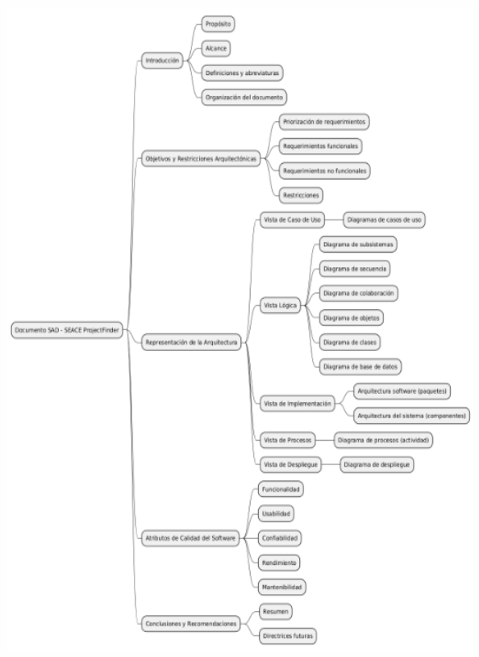
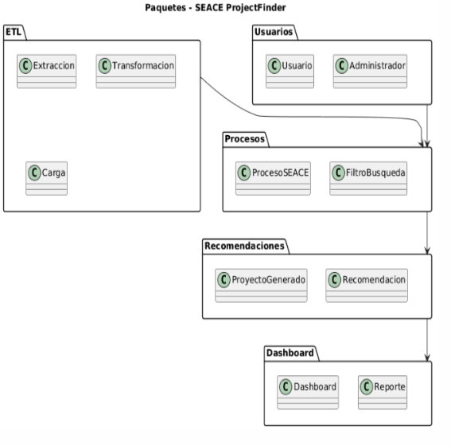
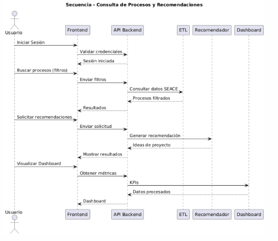
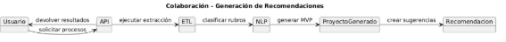
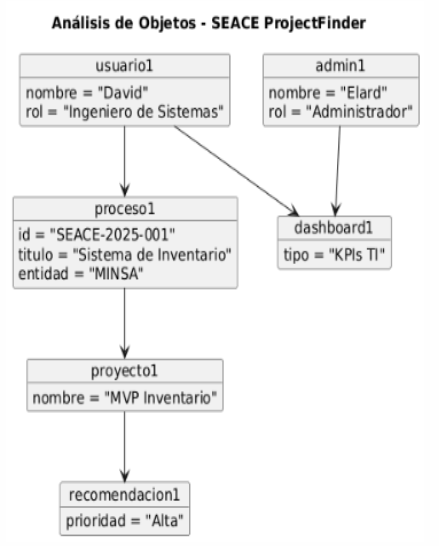
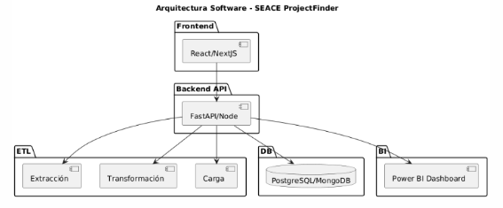
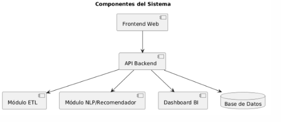
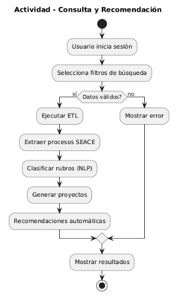
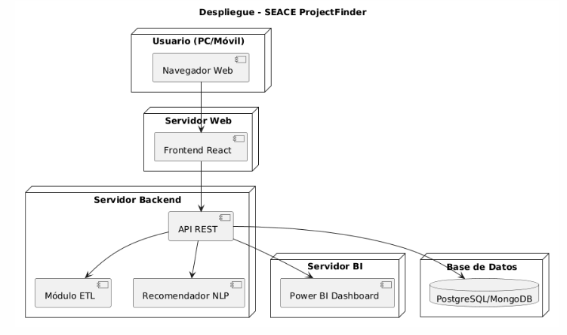



**UNIVERSIDAD PRIVADA DE TACNA**

**FACULTAD DE INGENIERÍA**

**Escuela Profesional de Ingeniería de Sistemas**
**\
\

` `**“Proyecto *SEACE ProjectFinder”***

**Curso:** 

*Inteligencia de Negocios*

**Docente:** 

*Mag. Patrick Cuadros Quiroga*\

**Integrantes:**

*Akhtar Oviedo, Ahmed Hasan		-	(2022074261)*

*Anampa Pancca, David Jordan		-	(2022074268)*

*Salas Jimenez, Walter Emmanuel 	-	(2022073896)*

**Tacna – Perú**

*2025*

|CONTROL DE VERSIONES||||||
| :-: | :- | :- | :- | :- | :- |
|Versión|Hecha por|Revisada por|Aprobada por|Fecha|Motivo|
|1\.0|AHAO,  DJAP, WESJ|ERM|-|09/09/25|Versión 1.0|
|2\.0|AHAO,  DJAP, WESJ|ERM|-|01/11/25|Versión 2.0|

**Sistema SEACE ProjectFinder**

**Documento de Arquitectura de Software**

**Versión *2.0***

|CONTROL DE VERSIONES||||||
| :-: | :- | :- | :- | :- | :- |
|Versión|Hecha por|Revisada por|Aprobada por|Fecha|Motivo|
|1\.0|AHAO, DJAP, WESJ|PC|PC|11/09/2025|Versión 1.0|
|2\.0|AHAO, DJAP, WESJ|PC|PC|11/09/2025|Versión 2.0|

INDICE GENERAL

**Contenido**

[***1.***](#_heading=h.3w2o7ayvmxc8)[***INTRODUCCIÓN	5***](#_heading=h.3w2o7ayvmxc8)

[**1.1.**](#_heading=h.dedfmnysphj2)[**Propósito (Diagrama 4+1)	5**](#_heading=h.dedfmnysphj2)

[**1.2.**](#_heading=h.i05xa5zgaybx)[**Alcance	5**](#_heading=h.i05xa5zgaybx)

[**1.3.**](#_heading=h.t3ip7auieji2)[**Definición, siglas y abreviaturas	5**](#_heading=h.t3ip7auieji2)

[**1.4.**](#_heading=h.j2y2nldva6u0)[**Organización del documento	5**](#_heading=h.j2y2nldva6u0)

[***2.***](#_heading=h.jrutmxdcw2wg)[***OBJETIVOS Y RESTRICCIONES ARQUITECTONICAS	5***](#_heading=h.jrutmxdcw2wg)

[2.1.1.](#_heading=h.uizbe8bzgfv)[Requerimientos Funcionales	5](#_heading=h.uizbe8bzgfv)

[2.1.2.](#_heading=h.bpk8ipd48kp)[Requerimientos No Funcionales – Atributos de Calidad	5](#_heading=h.bpk8ipd48kp)

[***3.***](#_heading=h.4ofk171kfpwu)[***REPRESENTACIÓN DE LA ARQUITECTURA DEL SISTEMA	6***](#_heading=h.4ofk171kfpwu)

[**3.1.**](#_heading=h.vd9cko2iz5cu)[**Vista de Caso de uso	6**](#_heading=h.vd9cko2iz5cu)

[3.1.1.](#_heading=h.avvmlkstnvh8)[Diagramas de Casos de uso	6](#_heading=h.avvmlkstnvh8)

[**3.2.**](#_heading=h.3wiaxquatc2o)[**Vista Lógica	6**](#_heading=h.3wiaxquatc2o)

[3.2.1.](#_heading=h.ek75h0s2kkw6)[Diagrama de Subsistemas (paquetes)	7](#_heading=h.ek75h0s2kkw6)

[3.2.2.](#_heading=h.sbjhgxl5xxxq)[Diagrama de Secuencia (vista de diseño)	7](#_heading=h.sbjhgxl5xxxq)

[3.2.3.](#_heading=h.d41rhx7rcbnz)[Diagrama de Colaboración (vista de diseño)	7](#_heading=h.d41rhx7rcbnz)

[3.2.4.](#_heading=h.m6prcxzxqdh)[Diagrama de Objetos	7](#_heading=h.m6prcxzxqdh)

[3.2.5.](#_heading=h.m16l2oqi1h7c)[Diagrama de Clases	7](#_heading=h.m16l2oqi1h7c)

[3.2.6.](#_heading=h.awhjy4de41kh)[Diagrama de Base de datos (relacional o no relacional)	7](#_heading=h.awhjy4de41kh)

[**3.3.**](#_heading=h.uqs7i771s21f)[**Vista de Implementación (vista de desarrollo)	7**](#_heading=h.uqs7i771s21f)

[3.3.1.](#_heading=h.yme51xx41td4)[Diagrama de arquitectura software (paquetes)	7](#_heading=h.yme51xx41td4)

[3.3.2.](#_heading=h.nhh33fmcv4z6)[Diagrama de arquitectura del sistema (Diagrama de componentes)	7](#_heading=h.nhh33fmcv4z6)

[**3.4.**](#_heading=h.ga3js6itz92k)[**Vista de procesos	7**](#_heading=h.ga3js6itz92k)

[3.4.1.](#_heading=h.rcjqfcqvs4p9)[Diagrama de Procesos del sistema (diagrama de actividad)	8](#_heading=h.rcjqfcqvs4p9)

[**3.5.**](#_heading=h.70itr0ypd3pa)[**Vista de Despliegue (vista física)	8**](#_heading=h.70itr0ypd3pa)

[3.5.1.](#_heading=h.sbzbtwv3iwfr)[Diagrama de despliegue	8](#_heading=h.sbzbtwv3iwfr)

[***4.***](#_heading=h.rx0aab6cuych)[***ATRIBUTOS DE CALIDAD DEL SOFTWARE	8***](#_heading=h.rx0aab6cuych)

[**Escenario de Funcionalidad	8**](#_heading=h.mzdg8unzfdfc)

[**Escenario de Usabilidad	8**](#_heading=h.d55iocdhqxkp)

[**Escenario de confiabilidad	9**](#_heading=h.1ncpkajvrbh4)

[**Escenario de rendimiento	9**](#_heading=h.62ixh1fmxgch)

[**Escenario de mantenibilidad	9**](#_heading=h.1fcixy80xuop)

[**Otros Escenarios	9**](#_heading=h.und7m5gehvk8)

1. INTRODUCCIÓN

El presente Documento de Análisis de Sistema (SAD) describe el proyecto denominado Sistema de Inteligencia de Negocios SEACE, cuyo objetivo principal es analizar, diseñar y definir la arquitectura del sistema que permitirá recopilar, organizar y procesar eficientemente la información proveniente del Sistema Electrónico de Contrataciones del Estado (SEACE).

Actualmente, la consulta de datos en el SEACE oficial resulta compleja debido al alto volumen de registros, formatos heterogéneos y opciones limitadas de búsqueda, lo que dificulta el análisis detallado de las contrataciones públicas y restringe la identificación de oportunidades de negocio, tendencias del mercado y patrones de inversión estatal.

Frente a esta problemática, el sistema propuesto busca centralizar la información de licitaciones, proveedores y contratos, clasificándola en categorías específicas y ofreciendo herramientas de consulta y visualización avanzadas. Esto permitirá transformar los datos crudos en información estructurada, clara y útil para la toma de decisiones estratégicas en contextos académicos, empresariales y de gestión pública.

El Sistema de Inteligencia de Negocios SEACE se plantea como un complemento del SEACE oficial, proporcionando un entorno más accesible y orientado al análisis de datos mediante reportes, dashboards y filtros personalizados, garantizando así una experiencia práctica para estudiantes, investigadores, gestores públicos y empresarios interesados en el estudio de las dinámicas del mercado de adquisiciones estatales.

1. Propósito (Diagrama 4+1)

   El presente documento describe la arquitectura de software del sistema SEACE ProjectFinder, una plataforma orientada a la extracción, organización, análisis y recomendación de proyectos de software a partir de procesos de contratación pública registrados en SEACE/OSCE.

   La visión arquitectónica se basa en el modelo 4+1 vistas de Kruchten, permitiendo abordar el sistema desde diferentes perspectivas:

- Vista de casos de uso: representación de funcionalidades principales y actores (usuario y administrador).
- Vista lógica: organización del sistema en subsistemas, objetos y clases.
- Vista de desarrollo/implementación: estructura de paquetes, componentes y arquitectura de software.
- Vista de procesos: representación de actividades y flujo de ejecución de procesos ETL y análisis.
- Vista física (despliegue): infraestructura tecnológica para el alojamiento y operación del sistema.

La arquitectura se diseña priorizando eficiencia y escalabilidad (para procesar grandes volúmenes de datos del SEACE) frente a portabilidad, aunque se mantiene soporte multiplataforma vía tecnologías web (NextJS, FastAPI, PostgreSQL, Power BI).

1. Alcance

   El sistema SEACE ProjectFinder abarca la construcción de una plataforma de inteligencia de negocios enfocada en la recopilación, organización, análisis y recomendación de proyectos de software a partir de los procesos de contratación pública registrados en el SEACE/OSCE. Su cobertura funcional considera desde la extracción, transformación y almacenamiento (ETL) de registros públicos, hasta su clasificación automática mediante técnicas de procesamiento de lenguaje natural (NLP), lo que permite categorizar convocatorias en rubros como Ingeniería de Sistemas, Construcción, Salud, Educación, Transporte, entre otros. A partir de dicha clasificación, el sistema generará ideas de proyectos acompañadas de un Producto Mínimo Viable (MVP) y un Sprint 1 de referencia, con el objetivo de transformar necesidades públicas en oportunidades concretas para los ingenieros de sistemas.

   La plataforma también incluirá un motor de búsqueda avanzada que permitirá a los usuarios filtrar procesos por categoría, entidad pública, región, monto, estado, fecha, anexos y nivel de complejidad, con la opción de exportar resultados a formatos PDF y Excel. De manera complementaria, se integrará un dashboard interactivo en Power BI que presentará estadísticas clave, comparaciones históricas y tendencias, facilitando así el análisis estratégico de oportunidades de proyectos. La gestión de usuarios permitirá diferenciar entre administradores, encargados de la configuración del sistema, control de accesos y ejecución de procesos ETL, y usuarios finales como ingenieros, investigadores o consultores, quienes accederán a la información y reportes de manera simplificada.

   En términos técnicos, el sistema será implementado bajo una arquitectura en capas compuesta por un frontend en React/NextJS, un backend basado en FastAPI/NodeJS, un módulo ETL especializado en extracción desde SEACE, una base de datos relacional o no relacional (PostgreSQL o MongoDB) y un dashboard conectado en Power BI. Esta arquitectura modular y escalable permitirá ampliar el alcance en fases futuras, integrando recomendaciones con inteligencia artificial (RAG + embeddings), métricas avanzadas de uso, analítica predictiva y despliegue en infraestructura en la nube.

1. Definición, siglas y abreviaturas

   En este apartado se presentan las definiciones de los términos, acrónimos y abreviaturas utilizados a lo largo del documento, con el propósito de asegurar una interpretación clara y uniforme. Los términos incluyen tanto conceptos técnicos como específicos del entorno del sistema.

- API (Application Programming Interface): Conjunto de métodos, protocolos y herramientas que permiten la comunicación entre el frontend, backend y otros servicios del sistema.
- BI (Business Intelligence): Conjunto de técnicas, metodologías y herramientas utilizadas para analizar información y generar conocimiento a través de dashboards y reportes interactivos.
- BD (Base de Datos): Repositorio estructurado donde se almacenan los procesos extraídos del SEACE, así como los usuarios, métricas y resultados procesados.
- Caso de uso: Representación gráfica y descriptiva de una funcionalidad del sistema, que muestra la interacción entre un actor (usuario o administrador) y el sistema.
- Dashboard: Panel de visualización de indicadores clave (KPIs), métricas y estadísticas, en este caso implementado con Power BI.
- ETL (Extract, Transform, Load): Proceso de extracción de datos del SEACE, transformación para su limpieza y estandarización, y carga en la base de datos del sistema.
- Frontend: Parte del sistema visible para el usuario, desarrollada en React/NextJS, que permite la interacción con el backend.
- KPI (Key Performance Indicator): Indicador clave de desempeño que permite evaluar la eficiencia y resultados del sistema.
- MVP (Minimum Viable Product / Producto Mínimo Viable): Versión inicial del sistema que ofrece un conjunto mínimo de funcionalidades para validar su utilidad y usabilidad.
- NLP (Natural Language Processing): Técnica de procesamiento de lenguaje natural utilizada para analizar y clasificar los textos de los procesos SEACE en rubros específicos.
- OSCE (Organismo Supervisor de las Contrataciones del Estado): Entidad pública que administra el SEACE en el Perú.
- Power BI: Herramienta de Microsoft utilizada para la construcción de dashboards y reportes visuales dinámicos.
- RAG (Retrieval-Augmented Generation): Técnica de inteligencia artificial que combina recuperación de información y generación de texto para brindar recomendaciones precisas.
- React/NextJS: Frameworks de JavaScript utilizados para construir la interfaz de usuario (frontend) del sistema.
- SEACE (Sistema Electrónico de Contrataciones del Estado): Plataforma oficial del Estado peruano donde se registran las contrataciones y licitaciones públicas.
- Sprint 1: Primera iteración de desarrollo que agrupa entregables iniciales derivados de la generación de proyectos.
- Usuario final: Actor del sistema que consulta información, realiza búsquedas y descarga reportes.
- Administrador: Actor encargado de la configuración del sistema, ejecución de procesos ETL, control de accesos y supervisión general.

1. Organización del documento

1. OBJETIVOS Y RESTRICCIONES ARQUITECTÓNICAS
   1. Priorización de requerimientos

      1. Requerimientos Funcionales

|**Requerimientos Funcionales (RF)**||||
| :-: | :- | :- | :- |
|**Código**|**Requerimiento**|**Concepto**|**Prioridad**|
|RF-01|Extracción de datos del SEACE|El sistema debe conectarse a SEACE/OSCE y extraer registros públicos (convocatorias, pliegos, anexos).|Crítico|
|RF-02|Clasificación automática de rubros|Implementar NLP para categorizar procesos por rubros (TI, salud, construcción, educación, etc.).|Crítico|
|RF-03|Generación de ideas de proyectos|A partir de cada proceso, generar entre 1–3 propuestas con entregables, MVP y Sprint 1.|Alto|
|RF-04|Catálogo consultable con filtros|Búsqueda avanzada por rubro, monto, entidad, anexos, complejidad.|Crítico|
|RF-05|Dashboard interactivo (Power BI / Web)|Mostrar KPIs, estadísticas y oportunidades priorizadas.|Alto|
|RF-06|Exportación de reportes|Exportar resultados en PDF y Excel.|Alto|
|RF-07|Registro de trazabilidad|Cada proyecto debe incluir id\_proceso y URL SEACE.|Alto|
|RF-08|Historial de consultas|Guardar búsquedas recientes por usuario.|Medio|
|RF-09|Gestión de usuarios|Crear, editar, eliminar usuarios y asignar roles.|Crítico|
|RF-10|Autenticación y seguridad|Login seguro con hash + sal, cierre de sesión y control de sesiones.|Crítico|
|RF-11|Sincronización ETL diaria|Extraer y actualizar datos cada día.|Crítico|
|RF-12|Sincronización ETL completa|Permitir reimportación total bajo demanda.|Alto|
|RF-13|Validación de conexión|Endpoint /etl/test-connection para verificar acceso.|Medio|
|RF-14|Procesamiento NLP avanzado|Clasificar y extraer requerimientos técnicos desde descripciones SEACE.|Crítico|
|RF-15|Guardar procesos|Almacenar en BD resultados de búsqueda/extracción.|Alto|
|RF-16|Configuración de dashboard|Definir KPIs y métricas personalizadas.|Medio|
|RF-17|Métricas de uso del chatbot|Estadísticas de consultas, sesiones y efectividad.|Bajo|
|RF-18|Logs de procesos ETL|Registrar ejecuciones (tiempo, estado, errores).|Alto|
|RF-19|Debug de procesos|Analizar estructura HTML/selenium en pruebas.|Bajo|
|RF-20|Mapeo SEACE → Proyecto|Convertir registro en 1–3 ideas de proyecto.|Crítico|

1. Requerimientos No Funcionales – Atributos de Calidad

|**Requerimientos No Funcionales (RNF)**||||
| :-: | :- | :- | :- |
|**Código**|**Requerimiento**|**Concepto**|**Prioridad**|
|RNF-01|Seguridad y acceso|El sistema debe contar con autenticación básica y perfiles de usuario (profesional, docente, investigador).|Medio|
|RNF-02|Rendimiento del sistema|La extracción y clasificación debe ejecutarse en menos de 5 segundos por consulta promedio.|Alto|
|RNF-03|Escalabilidad|La arquitectura debe permitir agregar más fuentes de datos sin rediseñar todo el sistema.|Medio|
|RNF-04|Disponibilidad|Plataforma disponible ≥ 95% del tiempo (horario laboral).|Alto|
|RNF-05|Usabilidad|La interfaz debe ser intuitiva, con navegación clara y adaptada a distintos niveles de experiencia.|Alto|
|RNF-06|Compatibilidad multiplataforma|El sistema debe funcionar en navegadores modernos y adaptarse a dispositivos móviles.|Medio|
|RNF-08|Accesibilidad mínima|Contraste, tipografía clara, navegación simple y adaptable.|Alto|
|RNF-09|Compatibilidad|Funcionar en navegadores modernos y dispositivos móviles comunes.|Alto|

1. Restricciones

   Una de las principales restricciones que tenemos en este proyecto es que dependo totalmente del portal SEACE/OSCE para extraer la información. El sistema debe conectarse a esta plataforma para obtener datos públicos, pero no está diseñada para integraciones automáticas. Si hacen cambios en su estructura, si el sitio se cae o si detectan actividad automatizada y bloquean el acceso, eso afectaría directamente el funcionamiento del sistema.

   También tenemos el reto de trabajar con documentos que no vienen en formatos uniformes. Muchos pliegos, anexos u otros archivos están en PDF o Word mal estructurados, escaneados o difíciles de procesar automáticamente. Esto limita mucho el uso de herramientas de procesamiento de lenguaje natural (NLP), que necesito para clasificar rubros o extraer requerimientos técnicos de manera precisa.

   Otro punto importante es la complejidad técnica del procesamiento de lenguaje natural. Necesitamos desarrollar un sistema capaz de leer y entender textos desestructurados, identificar temas clave y clasificarlos correctamente. Esto no solo requiere tiempo y pruebas, sino también modelos avanzados y entrenamiento con datos específicos del contexto peruano.

1. REPRESENTACIÓN DE LA ARQUITECTURA DEL SISTEMA

1. Vista de Caso de uso

En esta sección se describen los casos de uso del sistema (nombre de la aplicación), donde se abarcan todas las funcionalidades del sistema, se muestran los actores que interactúan en el sistema y las funcionalidades asociadas; asimismo se listará los casos de uso o escenarios del modelo de casos de uso que representen funcionalidades centrales del sistema final, que requieran una gran cobertura arquitectónica o aquellos que impliquen algún punto especialmente delicado de la arquitectura.

La documentación a incluir en esta sección corresponde a la obtenida como consecuencia de la actividad “Realización de casos de uso”:

\- Flujos de eventos- Diseño: descripción textual de cómo se realiza el caso de uso en términos de los objetos que colaboran. Resumen de los diagramas conectados con el caso de uso y explicación de sus relaciones.

\- Diagramas de interacción: Diagramas de secuencia, Diagramas de colaboración, objetos participantes, Diagramas de clases.

\- Requisitos derivados: Descripción textual que recoge todos los requisitos, normalmente los no funcionales, de la realización del caso de uso no que han de tenerse en cuenta durante la implementación]

1. Diagramas de Casos de uso

1. Vista Lógica

1. Diagrama de Subsistemas (paquetes)

   

1. Diagrama de Secuencia (vista de diseño)

1. Diagrama de Colaboración (vista de diseño)

`		`

1. Diagrama de Objetos

1. Diagrama de Clases

`		`

1. Diagrama de Base de datos (relacional o no relacional)

1. Vista de Implementación (vista de desarrollo)

   1. Diagrama de arquitectura software (paquetes)

1. Diagrama de arquitectura del sistema (Diagrama de componentes)

   

1. Vista de procesos

1. Vista de Despliegue (vista física)

1. ATRIBUTOS DE CALIDAD DEL SOFTWARE

Como equipo de desarrollo, somos conscientes de que un sistema no solo debe cumplir con sus funciones principales, sino también garantizar calidad en su desempeño, seguridad, facilidad de uso y mantenimiento a lo largo del tiempo. Por ello, además de los requerimientos funcionales que definen lo que el sistema hará, hemos identificado una serie de atributos de calidad (Quality Attributes, QAs) que consideramos esenciales para asegurar que el sistema SEACE ProjectFinder cumpla con las expectativas tanto técnicas como de usuario final.

.

Escenario de Funcionalidad

Para nosotros, la funcionalidad representa la base del sistema. Nos hemos enfocado en garantizar que todas las características planteadas, como la extracción de datos desde SEACE, la clasificación automática, la generación de ideas de proyectos, la visualización de dashboards y la exportación de reportes, estén bien implementadas y sean confiables. Más allá de implementar lo solicitado, nos preocupamos por asegurar que cada función tenga una utilidad clara para los usuarios y que el sistema mantenga su integridad frente a diferentes escenarios de uso.

Escenario de Usabilidad

Sabemos que muchos de nuestros usuarios no necesariamente serán expertos en tecnología, por eso priorizamos que la plataforma sea intuitiva, fácil de aprender y usar. Buscamos ofrecer una experiencia fluida, con una interfaz amigable, bien organizada y con mensajes claros. Además, queremos minimizar errores del usuario y ofrecer funcionalidades que se adapten a las necesidades de distintos perfiles (administradores, investigadores, ingenieros, etc.), garantizando confianza y satisfacción al utilizar el sistema.

Escenario de confiabilidad

Consideramos fundamental que el sistema sea confiable, tanto en el manejo de la información como en su disponibilidad. Como estamos trabajando con datos públicos y procesos de contratación estatal, aseguramos la integridad, disponibilidad y trazabilidad de la información. Estamos aplicando mecanismos de seguridad como autenticación con hash + sal, control de sesiones y trazabilidad de usuarios, además de registrar toda la actividad ETL y posibles errores. Esto nos permite reaccionar rápidamente ante incidentes y mantener la continuidad operativa del sistema.

Escenario de rendimiento

Dado que SEACE publica una gran cantidad de información diariamente, hemos diseñado una arquitectura capaz de manejar altos volúmenes de datos sin afectar la velocidad del sistema. Nuestro objetivo es garantizar tiempos de respuesta ágiles en búsquedas, generación de reportes y carga de dashboards, incluso cuando la base de datos crezca o se conecten múltiples usuarios al mismo tiempo. Para ello, priorizamos una infraestructura eficiente, procesamiento optimizado y consultas bien estructuradas.

Escenario de mantenibilidad

Desde el inicio, nos propusimos construir un sistema que sea fácil de mantener, extender y adaptar en el futuro. Hemos organizado el proyecto bajo una arquitectura en capas y modular, que nos permitirá hacer cambios o agregar nuevas funcionalidades (como más filtros, nuevos dashboards o motores de recomendación) sin afectar el resto del sistema. También estamos documentando correctamente el código y siguiendo buenas prácticas de desarrollo, para facilitar el trabajo de otros desarrolladores o futuros integrantes del equipo.

